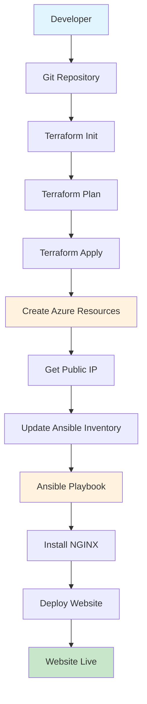

# 🏗️ Architecture Overview

## System Architecture

This project implements a **multi-tier cloud infrastructure** using Infrastructure as Code (IaC) principles with automated deployment and configuration management.

```
┌─────────────────────────────────────────────────────────────────────────────┐
│                           Azure Cloud Infrastructure                        │
├─────────────────────────────────────────────────────────────────────────────┤
│                                                                             │
│  ┌─────────────────┐    ┌─────────────────┐    ┌─────────────────┐        │
│  │   Terraform     │    │     Ansible     │    │     GitHub      │        │
│  │   (IaC)         │    │   (Config Mgmt) │    │   (Version Ctrl)│        │
│  └─────────────────┘    └─────────────────┘    └─────────────────┘        │
│           │                       │                       │                │
│           ▼                       ▼                       ▼                │
│  ┌─────────────────────────────────────────────────────────────────────────┐ │
│  │                    Azure Resource Group                                │ │
│  │  ┌─────────────────┐  ┌─────────────────┐  ┌─────────────────┐        │ │
│  │  │ Virtual Network │  │ Network Security│  │  Public IP      │        │ │
│  │  │ (10.0.0.0/16)  │  │ Group (NSG)     │  │  Address        │        │ │
│  │  │                 │  │ - SSH (Port 22) │  │                 │        │ │
│  │  │ ┌─────────────┐ │  │ - HTTP (Port 80)│  │                 │        │ │
│  │  │ │   Subnet    │ │  └─────────────────┘  └─────────────────┘        │ │
│  │  │ │(10.0.1.0/24)│ │                                               │ │
│  │  │ └─────────────┘ │  ┌─────────────────────────────────────────────┐ │ │
│  │  └─────────────────┘  │           Linux Virtual Machine             │ │ │
│  │                       │  ┌─────────────────┐  ┌─────────────────┐  │ │ │
│  │                       │  │   Ubuntu 20.04  │  │   NGINX Web     │  │ │ │
│  │                       │  │   LTS Server    │  │   Server        │  │ │ │
│  │                       │  │                 │  │                 │  │ │ │
│  │                       │  │ - SSH Access    │  │ - Static HTML   │  │ │ │
│  │                       │  │ - Admin User    │  │ - Port 80       │  │ │ │
│  │                       │  │ - SSH Keys      │  │ - Auto-start    │  │ │ │
│  │                       │  └─────────────────┘  └─────────────────┘  │ │ │
│  │                       └─────────────────────────────────────────────┘ │ │
│  └─────────────────────────────────────────────────────────────────────────┘ │
└─────────────────────────────────────────────────────────────────────────────┘
```

## Technology Stack

### **Infrastructure Layer**
- **Terraform** - Infrastructure as Code
- **Azure Resource Manager** - Cloud platform
- **Azure CLI** - Authentication and management

### **Networking Layer**
- **Virtual Network** - Isolated network environment
- **Network Security Group** - Firewall rules
- **Public IP** - External access point
- **Subnet** - Network segmentation

### **Compute Layer**
- **Azure Linux VM** - Ubuntu 20.04 LTS
- **SSH Access** - Secure remote management
- **Custom Scripts** - Automated setup

### **Application Layer**
- **NGINX** - Web server
- **Static HTML** - Website content
- **Ansible** - Configuration management

### **Development Tools**
- **PowerShell** - Windows automation
- **WSL** - Linux compatibility
- **Git** - Version control

## Security Architecture

```
┌─────────────────────────────────────────────────────────────────────────────┐
│                           Security Implementation                          │
├─────────────────────────────────────────────────────────────────────────────┤
│                                                                             │
│  🔐 Authentication & Access Control                                        │
│  ├── Azure Service Principal (Terraform)                                   │
│  ├── SSH Key-based Authentication (VM Access)                             │
│  └── Azure CLI Authentication (Management)                                │
│                                                                             │
│  🛡️ Network Security                                                       │
│  ├── Network Security Group (NSG)                                          │
│  │   ├── Inbound Rule: SSH (Port 22) - Allow                             │
│  │   └── Inbound Rule: HTTP (Port 80) - Allow                             │
│  ├── Private Subnet (10.0.1.0/24)                                         │
│  └── Public IP with Static Allocation                                      │
│                                                                             │
│  🔒 Data Protection                                                         │
│  ├── Encrypted VM Disks                                                    │
│  ├── Secure SSH Key Management                                             │
│  └── No Hardcoded Secrets in Code                                         │
│                                                                             │
│  🚀 Operational Security                                                   │
│  ├── Idempotent Deployments                                                │
│  ├── Automated Security Updates                                            │
│  └── Audit Trail via Terraform State                                       │
│                                                                             │
└─────────────────────────────────────────────────────────────────────────────┘
```

## Deployment Flow



## Resource Dependencies

```
Resource Group
├── Virtual Network
│   └── Subnet
│       └── Network Security Group Association
├── Public IP Address
├── Network Interface
│   ├── Subnet Association
│   └── Public IP Association
└── Linux Virtual Machine
    └── Network Interface Association
```

## Cost Optimization

- **B1s VM Size** - Cost-effective for development
- **Standard Storage** - Reliable and affordable
- **Auto-shutdown** - Reduce costs when not in use
- **Resource Cleanup** - Easy destruction with `terraform destroy`

## Scalability Considerations

- **Load Balancer** - Can be added for multiple VMs
- **Auto Scaling** - VM Scale Sets for traffic spikes
- **CDN** - Azure CDN for global content delivery
- **Database** - Azure Database services integration
- **Monitoring** - Azure Monitor and Application Insights 