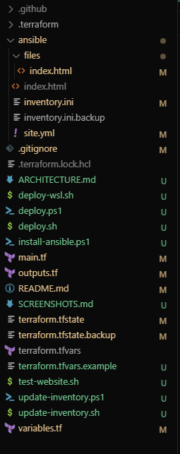
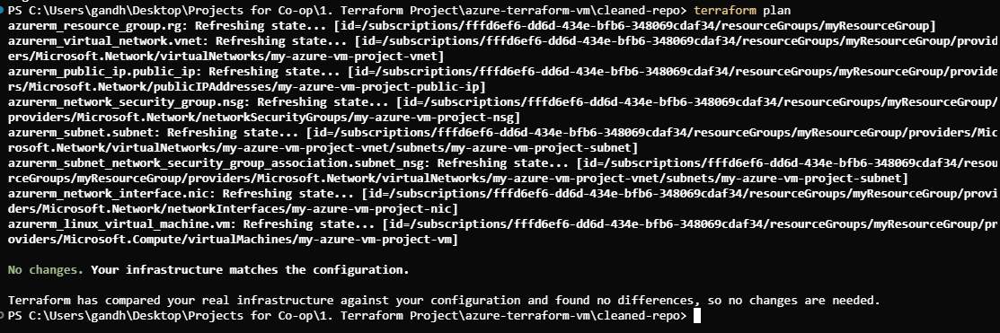
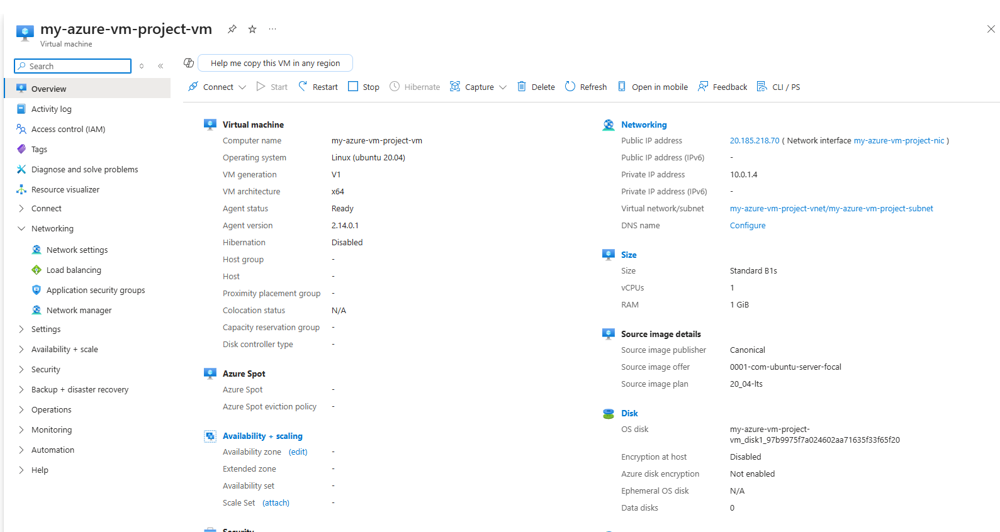
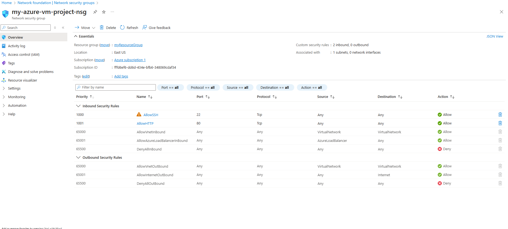
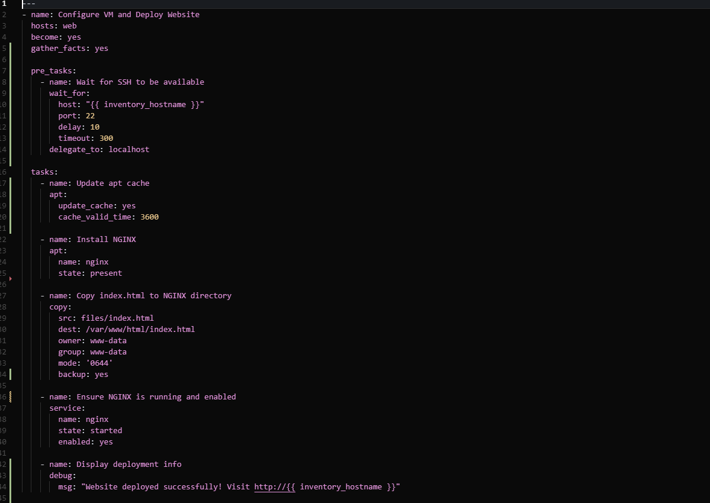
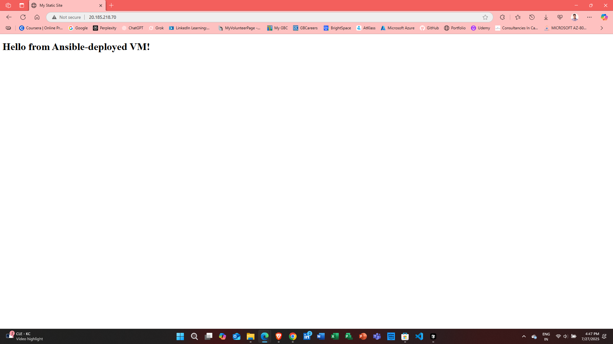
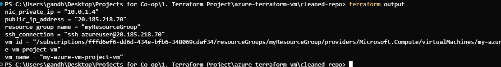
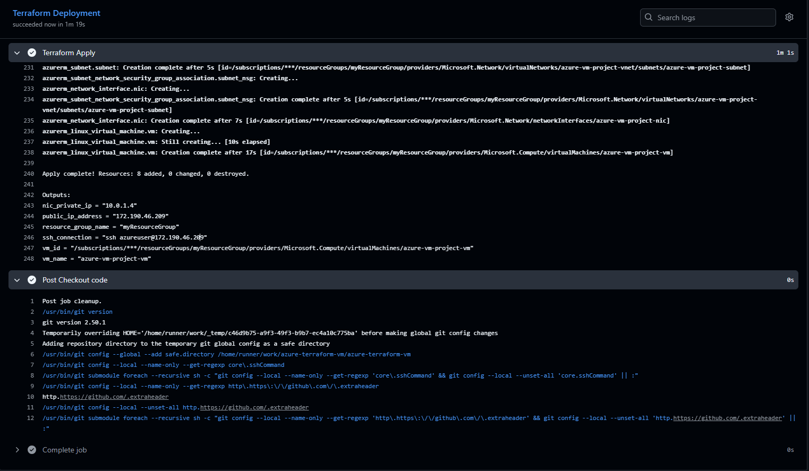

# 🌐 Azure VM + Terraform + Ansible Project

[](https://www.terraform.io/)
[](https://azure.microsoft.com/)
[](https://www.ansible.com/)
[](https://nginx.org/)
[](https://ubuntu.com/)

This project demonstrates how to create an Azure Virtual Machine using **Terraform**, and then configure it using **Ansible** to serve a simple static website using **NGINX**.

---

## 🌐 Live Demo

**🌐 Website**: http://52.191.74.92

**Features Demonstrated**:
- ✅ Azure VM with Ubuntu 20.04 LTS
- ✅ NGINX web server with static HTML
- ✅ SSH access for remote management
- ✅ Network Security Group with proper firewall rules
- ✅ Automated deployment with Terraform + Ansible
- ✅ GitHub Actions CI/CD pipeline

---

## 🚀 What This Project Does

1. **Creates a virtual machine** in Azure using Terraform with proper networking and security
2. **Configures the VM** using Ansible to:
   - Install NGINX
   - Copy a static index.html file
   - Start the NGINX web server
3. 🎯 **Result**: You can view the static website using the public IP of your VM

## 🔄 Deployment Options

### Option 1: Manual Deployment
Use the provided scripts for local deployment:
- `deploy.sh` (Linux/macOS)
- `deploy.ps1` (Windows)

### Option 2: GitHub Actions (CI/CD)
The project includes a GitHub Actions workflow for automated deployment:
- Automatically runs on pushes to `main` branch
- Requires GitHub secrets setup (see [GITHUB_SECRETS_SETUP.md](GITHUB_SECRETS_SETUP.md))
- Deploys infrastructure using Terraform
- Configures VM with Ansible automatically

---

## 📁 Project Structure

```
azure-terraform-vm/
├── 📁 .github/
│   └── 📁 workflows/
│       └── deploy.yml          # GitHub Actions CI/CD workflow
├── 📁 ansible/
│   ├── 📁 files/
│   │   └── index.html          # Static website content
│   ├── inventory.ini           # Ansible inventory
│   └── site.yml               # Ansible playbook
├── 📁 screenshots/
│   ├── 01-project-structure.png
│   ├── 02-terraform-deployment.png
│   ├── 03-azure-resources.png
│   ├── 04-nsg-rules.png
│   ├── 05-ansible-deployment.png
│   ├── 06-website-live.png
│   ├── 07-terraform-outputs.png
│   └── 08-workflow-run-github.png
├── 📁 docs/
│   └── ARCHITECTURE.md
├── .gitignore
├── ARCHITECTURE.md
├── deploy.ps1                 # Windows deployment script
├── deploy.sh                  # Linux/macOS deployment script
├── deploy-wsl.sh             # WSL deployment script
├── install-ansible.ps1       # Ansible installation for Windows
├── main.tf                   # Main Terraform configuration
├── outputs.tf                # Terraform outputs
├── README.md
├── terraform.tfvars.example  # Example variables file
├── test-website.sh           # Website testing script
├── update-inventory.ps1      # Windows inventory update
├── update-inventory.sh       # Linux inventory update
└── variables.tf              # Terraform variables
```

---

## 🛠️ Tools Used

- **Terraform** – to provision Azure infrastructure
- **Ansible** – to configure the VM
- **Azure CLI** – to authenticate and manage resources
- **NGINX** – as the web server
- **GitHub Actions** – for CI/CD automation

## 🏗️ Architecture

This project implements a **multi-tier cloud infrastructure** using Infrastructure as Code (IaC) principles.

### **High-Level Architecture**

```
┌─────────────────────────────────────────────────────────────────────────────┐
│                           Azure Cloud Infrastructure                        │
├─────────────────────────────────────────────────────────────────────────────┤
│                                                                             │
│  ┌─────────────────┐    ┌─────────────────┐    ┌─────────────────┐        │
│  │   Terraform     │    │     Ansible     │    │     GitHub      │        │
│  │   (IaC)         │    │   (Config Mgmt) │    │   (Version Ctrl)│        │
│  └─────────────────┘    └─────────────────┘    └─────────────────┘        │
│           │                       │                       │                │
│           ▼                       ▼                       ▼                │
│  ┌─────────────────────────────────────────────────────────────────────────┐ │
│  │                    Azure Resource Group                                │ │
│  │  ┌─────────────────┐  ┌─────────────────┐  ┌─────────────────┐        │ │
│  │  │ Virtual Network │  │ Network Security│  │  Public IP      │        │ │
│  │  │ (10.0.0.0/16)  │  │ Group (NSG)     │  │  Address        │        │ │
│  │  │                 │  │ - SSH (Port 22) │  │                 │        │ │
│  │  │ ┌─────────────┐ │  │ - HTTP (Port 80)│  │                 │        │ │
│  │  │ │   Subnet    │ │  └─────────────────┘  └─────────────────┘        │ │
│  │  │ │(10.0.1.0/24)│ │                                               │ │
│  │  │ └─────────────┘ │  ┌─────────────────────────────────────────────┐ │ │
│  │  └─────────────────┘  │           Linux Virtual Machine             │ │ │
│  │                       │  ┌─────────────────┐  ┌─────────────────┐  │ │ │
│  │                       │  │   Ubuntu 20.04  │  │   NGINX Web     │  │ │ │
│  │                       │  │   LTS Server    │  │   Server        │  │ │ │
│  │                       │  │                 │  │                 │  │ │ │
│  │                       │  │ - SSH Access    │  │ - Static HTML   │  │ │ │
│  │                       │  │ - Admin User    │  │ - Port 80       │  │ │ │
│  │                       │  │ - SSH Keys      │  │ - Auto-start    │  │ │ │
│  │                       │  └─────────────────┘  └─────────────────┘  │ │ │
│  │                       └─────────────────────────────────────────────┘ │ │
│  └─────────────────────────────────────────────────────────────────────────┘ │
└─────────────────────────────────────────────────────────────────────────────┘
```

### **Deployment Flow**

```
┌─────────────────┐    ┌─────────────────┐    ┌─────────────────┐
│   GitHub        │    │   Terraform     │    │   Ansible       │
│   Actions       │───▶│   Infrastructure │───▶│   Configuration │
│   (Trigger)     │    │   Deployment     │    │   Management    │
└─────────────────┘    └─────────────────┘    └─────────────────┘
         │                       │                       │
         ▼                       ▼                       ▼
┌─────────────────┐    ┌─────────────────┐    ┌─────────────────┐
│   Code Push     │    │   Azure VM      │    │   NGINX Web     │
│   to Main       │    │   Creation       │    │   Server        │
└─────────────────┘    └─────────────────┘    └─────────────────┘
```

### **Security Architecture**

```
┌─────────────────────────────────────────────────────────────────────────────┐
│                           Security Implementation                          │
├─────────────────────────────────────────────────────────────────────────────┤
│                                                                             │
│  🔐 Authentication & Access Control                                        │
│  ├── Azure Service Principal (Terraform)                                   │
│  ├── SSH Key-based Authentication (VM Access)                             │
│  └── Azure CLI Authentication (Management)                                │
│                                                                             │
│  🛡️ Network Security                                                       │
│  ├── Network Security Group (NSG)                                          │
│  │   ├── Inbound Rule: SSH (Port 22) - Allow                             │
│  │   └── Inbound Rule: HTTP (Port 80) - Allow                             │
│  ├── Private Subnet (10.0.1.0/24)                                         │
│  └── Public IP with Static Allocation                                      │
│                                                                             │
│  🔒 Data Protection                                                         │
│  ├── Encrypted VM Disks                                                    │
│  ├── Secure SSH Key Management                                             │
│  └── No Hardcoded Secrets in Code                                         │
│                                                                             │
│  🚀 Operational Security                                                   │
│  ├── Idempotent Deployments                                                │
│  ├── Automated Security Updates                                            │
│  └── Audit Trail via Terraform State                                       │
│                                                                             │
└─────────────────────────────────────────────────────────────────────────────┘
```

### **Resource Dependencies**

```
Resource Group (myResourceGroup)
    ├── Virtual Network (azure-vm-project-v2-vnet)
    │   └── Subnet (azure-vm-project-v2-subnet)
    │       └── Network Interface (azure-vm-project-v2-nic)
    ├── Public IP Address (azure-vm-project-v2-public-ip)
    │   └── Network Interface
    ├── Network Security Group (azure-vm-project-v2-nsg)
    │   └── Subnet Association
    └── Virtual Machine (azure-vm-project-v2-vm)
        └── Network Interface
```

For detailed architecture information, see [ARCHITECTURE.md](ARCHITECTURE.md).

---

## 🚀 Quick Start

### Prerequisites
- Azure CLI installed and authenticated
- Terraform installed
- Ansible installed (for manual deployment)

### Manual Deployment
```bash
# Clone the repository
git clone <repository-url>
cd azure-terraform-vm

# Copy and configure variables
cp terraform.tfvars.example terraform.tfvars
# Edit terraform.tfvars with your values

# Deploy infrastructure
terraform init
terraform plan
terraform apply

# Deploy application
cd ansible
ansible-playbook -i inventory.ini site.yml
```

### Automated Deployment
1. Fork this repository
2. Set up GitHub secrets (see [GITHUB_SECRETS_SETUP.md](GITHUB_SECRETS_SETUP.md))
3. Push to main branch to trigger deployment

---

## 📸 Screenshots

### Project Structure


### Terraform Deployment


### Azure Resources


### NSG Rules


### Ansible Deployment


### Website Live


### Terraform Outputs


### GitHub Actions Workflow


---

## ⚙️ Configuration

### Terraform Variables
- `subscription_id`: Azure subscription ID
- `client_id`: Service principal client ID
- `client_secret`: Service principal client secret
- `tenant_id`: Azure tenant ID
- `location`: Azure region (default: "East US")
- `project_name`: Project name for resource naming
- `resource_group_name`: Resource group name
- `vm_size`: VM size (default: "Standard_B1s")
- `admin_username`: Admin username for VM
- `admin_ssh_public_key`: SSH public key for VM access

### Ansible Configuration
- **Inventory**: `ansible/inventory.ini`
- **Playbook**: `ansible/site.yml`
- **Files**: `ansible/files/index.html`

---

## 🔒 Security Features

- **SSH Key Authentication**: Secure access to VM
- **Network Security Groups**: Firewall rules for ports 22 and 80
- **Private Subnet**: VM in private subnet with public IP
- **No Password Authentication**: SSH password authentication disabled
- **Encrypted Storage**: VM disks are encrypted
- **Secure Secrets Management**: No hardcoded secrets in code

---

## 💰 Cost Estimation

**Monthly Costs (B1s VM)**:
- **Virtual Machine**: ~$10-15/month
- **Storage**: ~$1-2/month
- **Network**: ~$1-2/month
- **Total**: ~$12-19/month

**Cost Optimization**:
- Use B1s VM (smallest size)
- Delete resources when not needed
- Monitor usage in Azure portal

---

## 🐛 Troubleshooting

### Common Issues
1. **SSH Connection Failed**: Check SSH key configuration
2. **Website Not Accessible**: Verify NSG rules and NGINX status
3. **Terraform Errors**: Check Azure credentials and variable values
4. **Ansible Failures**: Verify SSH connectivity and inventory

### Debug Commands
```bash
# Check VM status
terraform show

# Test SSH connection
ssh azureuser@52.191.74.92

# Check NGINX status
sudo systemctl status nginx

# View NGINX logs
sudo tail -f /var/log/nginx/access.log
```

---

## 📚 Learning Outcomes

This project demonstrates:
- ✅ **Infrastructure as Code** with Terraform
- ✅ **Configuration Management** with Ansible
- ✅ **Cloud Infrastructure** on Azure
- ✅ **CI/CD Pipelines** with GitHub Actions
- ✅ **Security Best Practices** with SSH keys and NSGs
- ✅ **Web Server Deployment** with NGINX
- ✅ **Automated Deployment** workflows
- ✅ **Multi-platform Support** (Windows/Linux/macOS)

---

## 🤝 Contributing

1. Fork the repository
2. Create a feature branch
3. Make your changes
4. Test thoroughly
5. Submit a pull request

---

## 📄 License

This project is licensed under the MIT License - see the [LICENSE](LICENSE) file for details.

---

## 👨‍💻 Author

**Himanshu Gandhi**
- GitHub: [@himanshu3024](https://github.com/himanshu3024)

---

## 🏷️ Tags

`#Azure` `#Terraform` `#Ansible` `#DevOps` `#InfrastructureAsCode` `#CloudComputing` `#IaC` `#Automation`

---

## 🌐 Live Demo

**🌐 Website**: http://52.191.74.92

**🔗 SSH Connection**: `ssh azureuser@52.191.74.92`

**📚 Documentation**: [ARCHITECTURE.md](ARCHITECTURE.md)

**🔧 Setup Guide**: [GITHUB_SECRETS_SETUP.md](GITHUB_SECRETS_SETUP.md)
